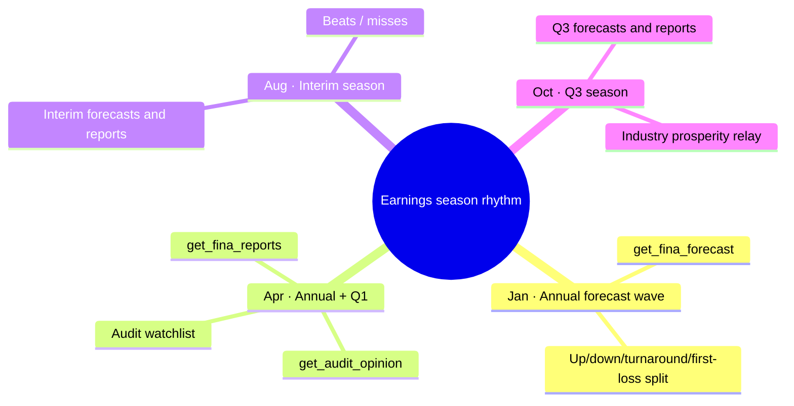

# 📅 Earnings Season Tracker Skill

[简体中文](README.md) | **English**

> Scan the **whole A-share market** cross-sectionally across an earnings-season window: forecast-type distribution, beat/blow-up leaderboards, industry earnings prosperity, and annual-season audit-opinion watchlists — every data point annotated with its source interface and reporting period, with optional scheduled runs during earnings season.

<p align="center">
  
  
  
  
  
  
</p>

---

## 📖 What is this

`earnings-season-tracker` is an **Agent Skill**: a **whole-market, cross-sectional** scan of corporate earnings during an **earnings-season time window**. It does not watch a single ticker, nor filter by custom conditions — it answers "**what does the whole market's earnings picture look like this season**": who issued forecasts, how upgrades/downgrades are distributed, which names beat, which names blew up, which industries are collectively prospering or collectively imploding, and which companies received non-standard audit opinions in annual-report season.

Every conclusion is annotated with its source interface and reporting period (`end_date`), and distinguishes single-quarter from cumulative caliber. A scan is a **point-in-time snapshot**, because forecasts, flash reports, and final reports are disclosed progressively through the season.

> All data contracts come from the sibling skill [`pandadata-api`](https://github.com/quantskills/skill-pandadata-api); this skill decides *what to query and how to aggregate*, not *what the interfaces look like*.

---

## 🧭 Boundaries vs. sibling skills (no overlap)

| Skill | View | When to use |
|---|---|---|
| 📅 **earnings-season-tracker** (this) | **Whole market × earnings-season window** cross-sectional aggregation | "How is the whole market doing this season", "forecast-type distribution", "beat/blow-up leaders" |
| 🩺 `a-share-stock-dossier` | **Single-name** deep due diligence | Want to drill into one name from a scan → hand off to it |
| 🔎 `stock-screener` | **One-shot natural-language conditional** filtering | Want to filter by "PE < 20 and northbound buying" → hand off to it |
| 🚨 `event-risk-alert` | **Per-name** monitoring of a watchlist / holdings | Want to monitor your own positions → hand off to it |
| 🌐 `macro-monitor` | **Top-down** industry prosperity | **Cross-checks** this skill's "industry earnings prosperity" |

---

## 🗓️ Earnings-season rhythm



---

## ⚡ Scan pipeline

```mermaid
flowchart LR
    A["🗓️ Resolve season window<br/>annual/Q1/interim/Q3"] --> B["📇 Calendar & universe<br/>get_trade_cal·get_trade_list"]
    B --> C["📣 Forecast scan<br/>get_fina_forecast market-wide"]
    C --> D["📊 Flash / final reports land<br/>get_fina_performance·get_fina_reports"]
    D --> E["🏭 Industry aggregation<br/>get_stock_industry·get_industry_constituents"]
    E --> F["🧾 Audit non-standard (annual)<br/>get_audit_opinion"]
    F --> G["📝 8-section scan report<br/>every conclusion traceable"]

    style A fill:#fff3e0,stroke:#ef6c00
    style C fill:#e3f2fd,stroke:#1976d2
    style F fill:#ffebee,stroke:#c62828
    style G fill:#e8f5e9,stroke:#388e3c
```



---

## 🗂️ Report sections × interface map

| Section | Interfaces | Question answered |
|---|---|---|
| 📈 **Disclosure progress** | `get_trade_list` · `get_fina_forecast` · `get_fina_performance` · `get_fina_reports` | How many names disclosed (forecast/flash/final) vs. the universe? |
| 📣 **Forecast-type distribution** | `get_fina_forecast` | Counts of up/down/turnaround/first-loss/continued-loss/mild-up…; magnitude ranking. |
| 🚀 **Beat / blow-up leaderboard** | `get_fina_forecast` · `get_fina_performance` · `get_fina_reports` | Who beat hardest, who blew up worst (with baseline labeled)? |
| 🏭 **Industry earnings prosperity** | `get_industry_constituents` · `get_stock_industry` · `get_industry_detail` | Which industries are collectively beating / imploding? (cross-checks `macro-monitor`) |
| 🧾 **Audit watchlist (annual)** | `get_audit_opinion` | Which firms received qualified / adverse / disclaimer opinions? |

> Calendar & universe helpers: `get_last_trade_date` · `get_trade_cal` · `get_trade_list`.

---

## 🚀 Quick start

### 1️⃣ Install (together with pandadata-api)

```bash
# Claude Code (global)
cp -r skill-pandadata-api           ~/.claude/skills/pandadata-api
cp -r skill-earnings-season-tracker ~/.claude/skills/earnings-season-tracker

# Codex (global, Agent Skills standard directory recommended)
mkdir -p ~/.agents/skills
cp -r skill-pandadata-api ~/.agents/skills/pandadata-api
cp -r skill-earnings-season-tracker ~/.agents/skills/earnings-season-tracker

# Cursor (project level)
mkdir -p .cursor/skills
cp -r skill-pandadata-api .cursor/skills/pandadata-api
cp -r skill-earnings-season-tracker .cursor/skills/earnings-season-tracker
```

### 2️⃣ Ask in natural language

```text
Scan the whole-market forecast distribution for this earnings season
Which industries are collectively beating this season? Which are blowing up?
Pull me the 2025 annual-season audit non-standard list
Build an earnings-season scan report, focus on up/down forecasts and first/continued losses
Set up an after-close scan that runs every trading day during earnings season
```

### 3️⃣ Report structure (8 sections)

```
Summary → Disclosure progress → Forecast-type distribution → Beat/blow-up leaderboard
→ Industry earnings prosperity → Audit watchlist (annual) → Risk notes → Data notes
```

The data-notes section is a table: `data module | source interface | query window | rows returned | reporting period/data date | notes`.

---

## ⏰ Scheduling (earnings-season auto-scan)

Run only during **active earnings-season windows** (Jan / Apr / Jul–Aug / Oct) on trading days after close, preferably after `18:30 Asia/Shanghai` so late disclosures settle. The task is idempotent: if `reports/earnings/<period>.md` already exists, regenerate and overwrite it to keep the rolling snapshot current. Skip non-trading days and dormant months instead of producing an empty report.

---

## 📦 Directory layout

```
earnings-season-tracker/
├── SKILL.md                          # Skill entry: positioning/boundaries, season calendar, workflow, interface map, analysis modes, rules, automation
├── references/
│   └── earnings-season-guide.md      # 📒 Routing table, forecast-type definitions, beat/miss rules, industry aggregation, report skeleton, empty-data handling, QA checklist
├── scripts/
│   └── validate_report.py            # ✅ Checks required sections, source notes, reporting-period labels, disclaimer
└── agents/
    ├── cursor-rule.mdc               # Cursor adapter
    ├── openai.yaml                   # OpenAI/Codex adapter
    └── portable-loader.md            # Claude Code/Hermes/OpenClaw adapter
```

---

## 📐 Core constraints

| Constraint | Description |
|---|---|
| 🧾 Contract first | Every call is checked against `pandadata-api` for parameters and fields; no invented interfaces |
| 🗓️ Label the period | Every financial figure states its reporting period `end_date`, with single-quarter vs. cumulative caliber distinguished, never mixed |
| 📸 Snapshot nature | Forecasts/flash/final reports accumulate through the season; a scan is a point-in-time snapshot and must carry its snapshot date |
| 🏷️ No re-labeling types | Forecast types are reported as the source assigns them; never re-bucketed |
| ⚖️ Transparent baseline | "Beat/blow-up" is a derived judgment; the comparison baseline must be stated (forecast vs. actual / flash vs. forecast / report vs. forecast) |
| 🕳️ Report empty data honestly | Sections without data keep their heading plus "no data + query method/window"; never silently skipped |
| 🗣️ Restrained wording | Use "may indicate" / "worth monitoring"; no up/down calls, no buy/sell language |

---

## ⚠️ Disclaimer

Reports are generated from public data and rule-based analysis, for research reference only. Nothing here constitutes investment advice.

## 📜 License

This project is licensed under the GNU General Public License v3.0. See [LICENSE](LICENSE).

## 🐼 PandaAI / QUANTSKILLS Community

<div align="center">
  
  <br>
  <sub>Scan the QR code to join the PandaAI community for QUANTSKILLS skills, agent workflows, and quantitative research practice.</sub>
</div>
