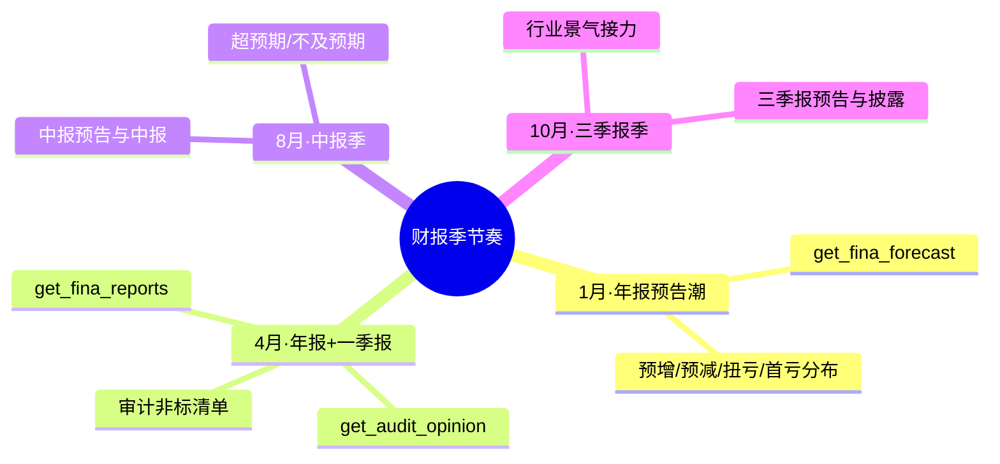

# 📅 Earnings Season Tracker Skill

**简体中文** | [English](README.en.md)

> 按财报季时间窗对**全市场**做业绩横截面扫描：业绩预告类型分布、超预期/暴雷个股榜、行业业绩景气分布、年报季审计非标清单 —— 每个数据点标注来源接口与报告期，支持财报季定时运行。

<p align="center">
  
  
  
  
  
  
</p>

---

## 📖 这是什么

`earnings-season-tracker` 是一个 **Agent Skill**：在**财报季的时间窗口**里，对**全市场**做业绩横截面扫描。它不盯单只票、也不按自定义条件筛选，而是回答"**这一季，整个市场的业绩长什么样**"——谁发了预告、预增预减如何分布、哪些票超预期、哪些票暴雷、哪些行业在集体景气或集体爆雷、年报季有哪些公司拿到了非标审计意见。

每一个结论都标注来源接口与报告期（`end_date`），区分单季/累计口径；扫描结果是**某一时点的快照**，因为预告、快报、正式报告会随季节逐步累积披露。

> 数据契约一律来自姊妹技能 [`pandadata-api`](https://github.com/quantskills/skill-pandadata-api)；本技能负责"查什么、怎么聚合"，不负责"接口长什么样"。

---

## 🧭 与同生态技能的边界（避免撞车）

| 技能 | 视角 | 何时用 |
|---|---|---|
| 📅 **earnings-season-tracker**（本技能） | **全市场 × 财报季时间窗** 横截面聚合 | "这一季全市场业绩怎么样""预告类型分布""超预期暴雷榜" |
| 🩺 `a-share-stock-dossier` | **单票**深度尽调 | 想对扫描里某只票深挖 → 移交它 |
| 🔎 `stock-screener` | **自然语言单次条件**筛选 | 想按"PE<20 且北向加仓"等条件过滤 → 移交它 |
| 🚨 `event-risk-alert` | **自选/持仓清单**单票事件预警 | 想监控自己持仓的风险 → 移交它 |
| 🌐 `macro-monitor` | **自上而下**行业景气度 | 与本技能的"行业业绩景气分布"**互相印证** |

---

## 🗓️ 财报季节奏



---

## ⚡ 扫描流水线


---

## 🗂️ 报告章节 × 接口映射

| 章节 | 接口 | 回答什么 |
|---|---|---|
| 📈 **披露进度概览** | `get_trade_list` · `get_fina_forecast` · `get_fina_performance` · `get_fina_reports` | 已披露多少家（预告/快报/正报）占全市场比例？ |
| 📣 **业绩预告类型分布** | `get_fina_forecast` | 预增/预减/扭亏/首亏/续亏/略增…各多少家、变动幅度排行？ |
| 🚀 **超预期 / 暴雷个股榜** | `get_fina_forecast` · `get_fina_performance` · `get_fina_reports` | 谁超预期最猛、谁暴雷最狠（标注比较基准）？ |
| 🏭 **行业业绩景气分布** | `get_industry_constituents` · `get_stock_industry` · `get_industry_detail` | 哪些行业在集体超预期/集体暴雷？（与 `macro-monitor` 互证） |
| 🧾 **审计非标清单（年报季）** | `get_audit_opinion` | 哪些公司被出具保留/否定/无法表示意见？ |

> 日历与股票池辅助：`get_last_trade_date` · `get_trade_cal` · `get_trade_list`。

---

## 🚀 快速开始

### 1️⃣ 安装（与 pandadata-api 一起）

```bash
# Claude Code（全局）
cp -r skill-pandadata-api          ~/.claude/skills/pandadata-api
cp -r skill-earnings-season-tracker ~/.claude/skills/earnings-season-tracker

# Codex（全局，推荐开放 Agent Skills 标准目录）
mkdir -p ~/.agents/skills
cp -r skill-pandadata-api ~/.agents/skills/pandadata-api
cp -r skill-earnings-season-tracker ~/.agents/skills/earnings-season-tracker

# Cursor（项目级）
mkdir -p .cursor/skills
cp -r skill-pandadata-api .cursor/skills/pandadata-api
cp -r skill-earnings-season-tracker .cursor/skills/earnings-season-tracker
```

### 2️⃣ 直接用自然语言提问

```text
扫一遍这个财报季的全市场业绩预告分布
本季哪些行业在集体超预期？哪些在暴雷？
2025 年报季的审计非标清单帮我拉一份
做一份财报季扫描报告，重点看预增预减和首亏续亏
设置一个财报季每个交易日盘后自动跑的扫描任务
```

### 3️⃣ 报告结构（8 章）

```
摘要 → 披露进度概览 → 业绩预告类型分布 → 超预期/暴雷个股榜
→ 行业业绩景气分布 → 审计非标清单（年报季）→ 风险提示 → 数据说明
```

数据说明为表格：`数据模块 | 来源接口 | 查询窗口 | 返回行数 | 报告期/数据日 | 备注`。

---

## ⏰ 定时（财报季自动扫描）

仅在**活跃财报季窗口**（1月 / 4月 / 7–8月 / 10月）的交易日盘后运行，建议 `18:30 Asia/Shanghai` 之后，给晚披露留出沉淀时间。任务幂等：若 `reports/earnings/<period>.md` 已存在则覆盖重写，保持滚动快照最新；非交易日与休眠月份跳过，不产出空报告。

---

## 📦 目录结构

```
earnings-season-tracker/
├── SKILL.md                          # 技能入口：定位边界、财报季日历、工作流、接口映射、分析模式、规则、自动化
├── references/
│   └── earnings-season-guide.md      # 📒 路由表、预告类型口径、超预期判定、行业聚合法、报告骨架、空数据处理、QA清单
├── scripts/
│   └── validate_report.py            # ✅ 校验报告必备章节/来源标注/报告期/免责声明
└── agents/
    └── openai.yaml                   # OpenAI/Codex 适配
```

---

## 📐 核心约束

| 约束 | 说明 |
|---|---|
| 🧾 先查契约 | 所有调用先经 `pandadata-api` 核对参数字段，不发明接口 |
| 🗓️ 标注报告期 | 每个财务数据写明报告期 `end_date`，区分单季/累计口径，不混用 |
| 📸 快照属性 | 预告/快报/正报随季节累积，扫描是某时点快照，须标注快照日 |
| 🏷️ 类型不改写 | 预告类型按源接口给定值呈现，不自行重新归类 |
| ⚖️ 基准透明 | "超预期/暴雷"是衍生判断，必须写明比较基准（预告 vs 实际 / 快报 vs 预告 / 正报 vs 预告） |
| 🕳️ 空数据如实报 | 无数据的章节保留标题并写明"无数据 + 查询方法/窗口"，不静默跳过 |
| 🗣️ 措辞克制 | 用"可能提示""需要关注"，不下涨跌结论，不用买卖语言 |

---

## ⚠️ 免责声明

本报告基于公开数据与规则化分析生成，仅供研究参考，不构成任何投资建议。

## 📜 License

This project is licensed under the GNU General Public License v3.0. See [LICENSE](LICENSE).

## 🐼 PandaAI / QUANTSKILLS 社群

<div align="center">
  
  <br>
  <sub>扫码加入 PandaAI 社群，交流 QUANTSKILLS 技能、Agent 工作流与量化研究实践。</sub>
</div>
